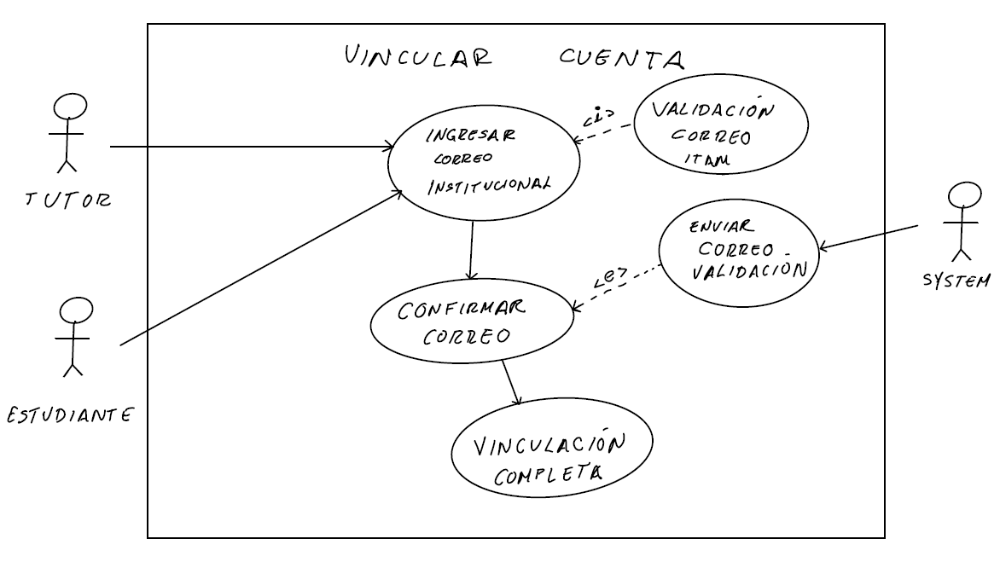
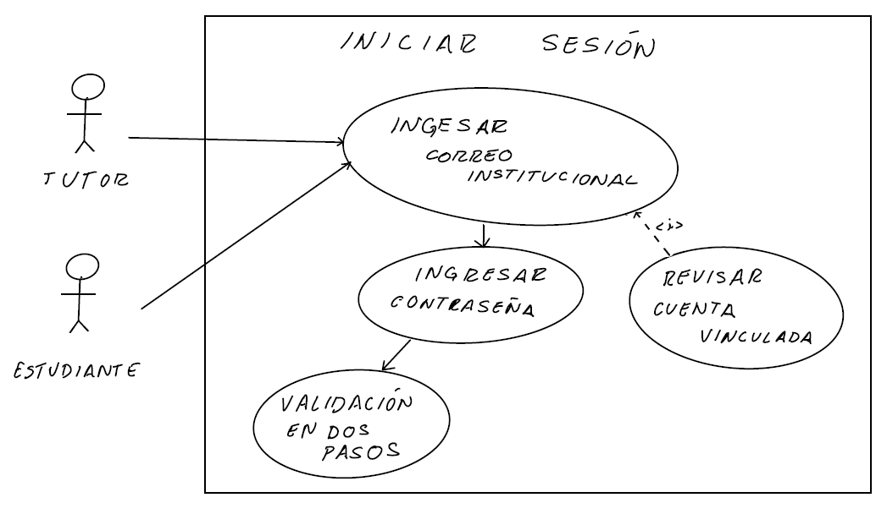
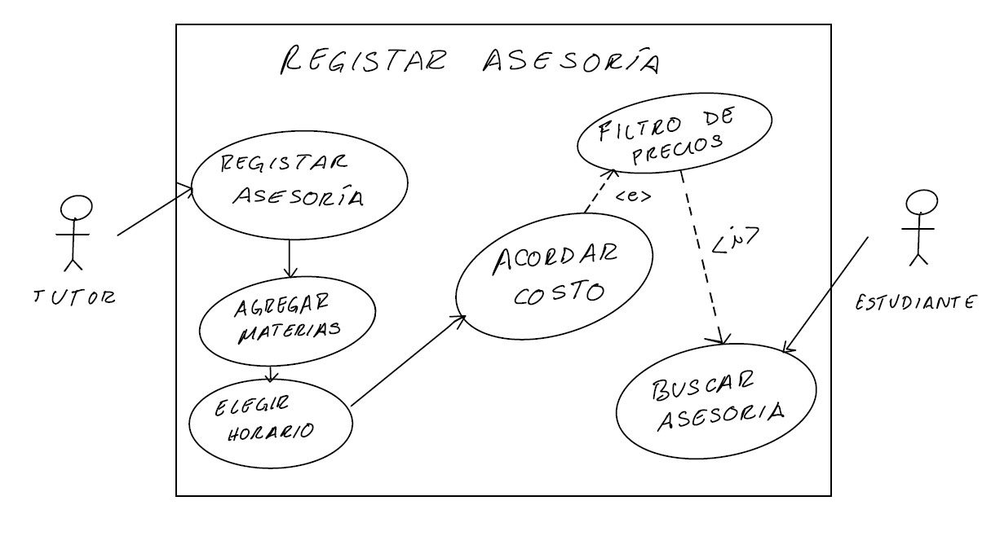
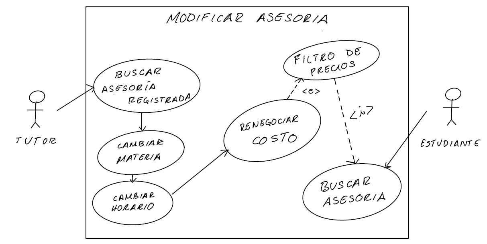
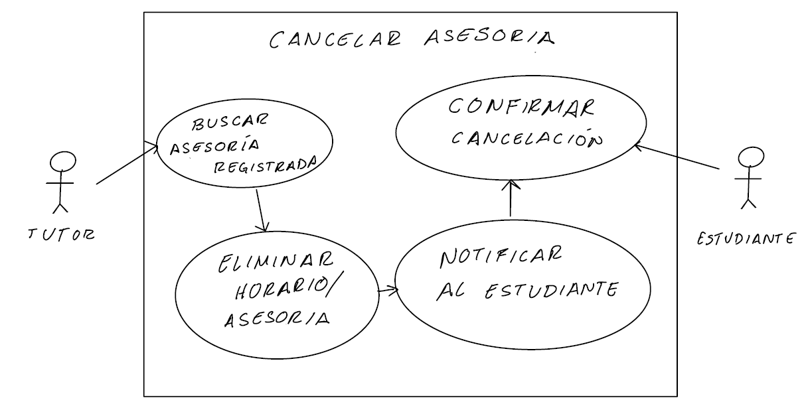
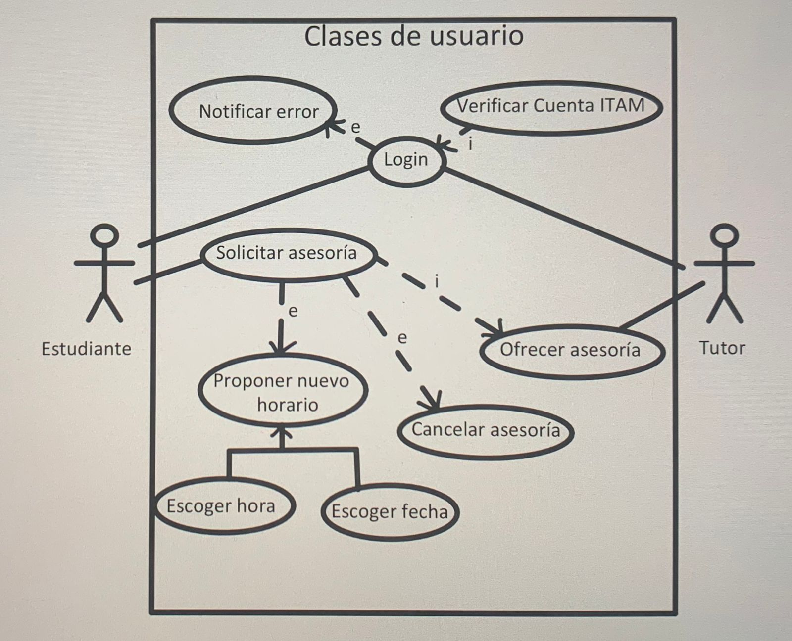
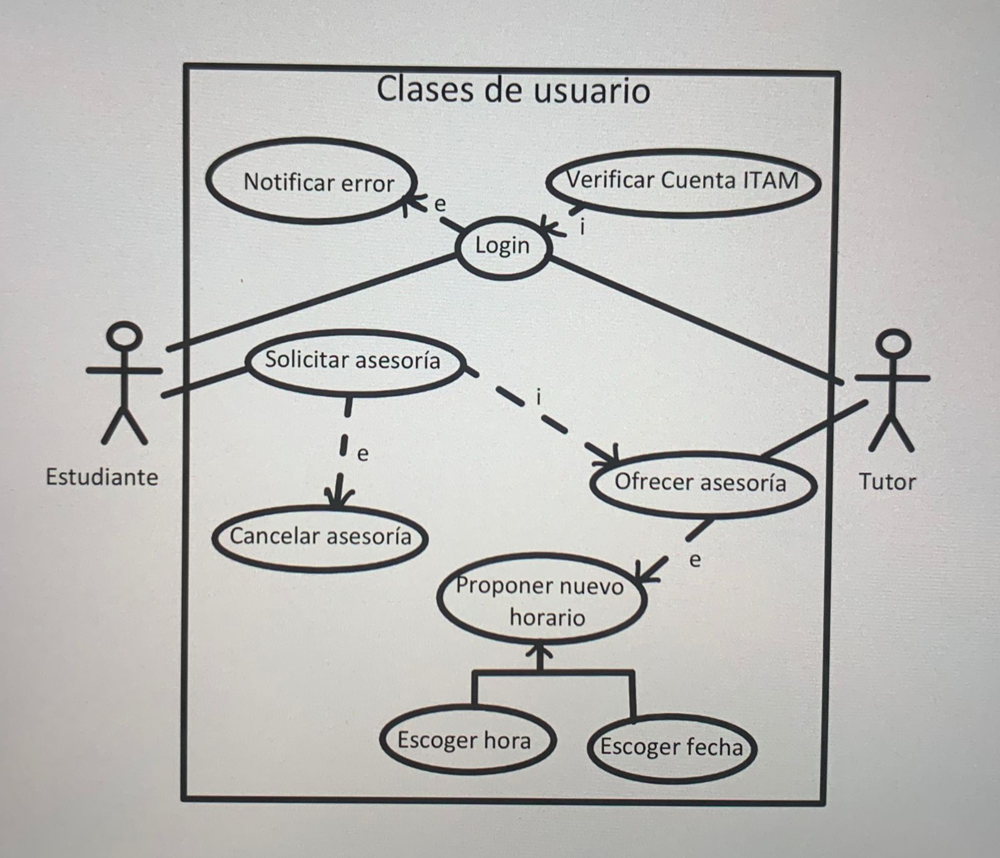
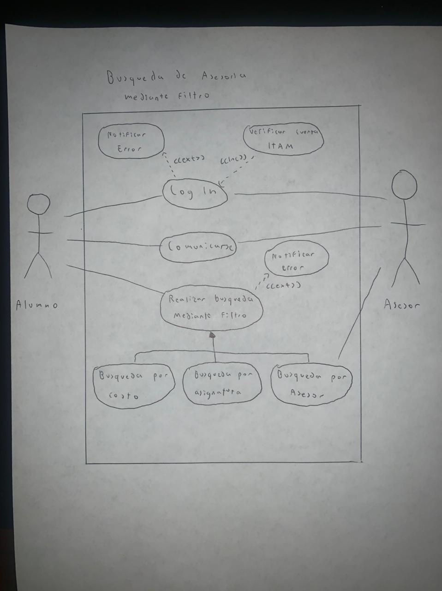
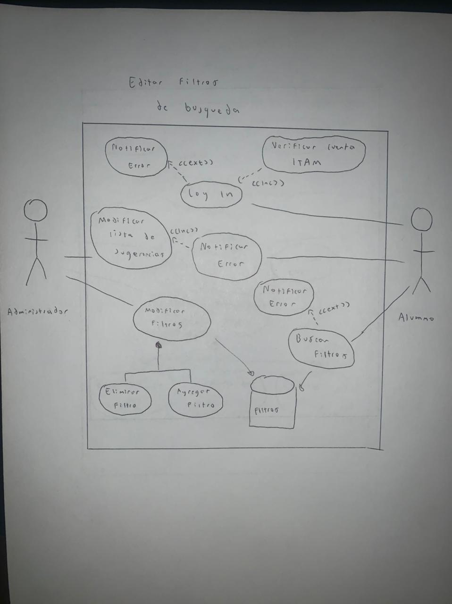
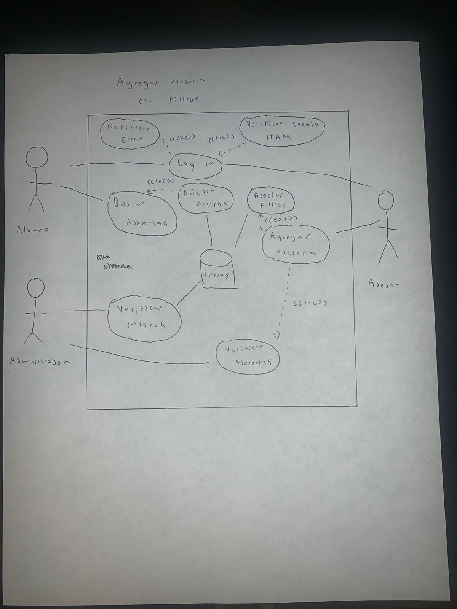

# Casos de Uso

---

- Los usuarios deben poder vincular su cuenta del ITAM, iniciar y cerrar sesión.

- Los tutores deben poder registrar, modificar y cancelar sus asesorías (horario, materias, costo).

- Los estudiantes deben poder aceptar, cancelar o proponer un nuevo horario para las asesorías.

- Los estudiantes pueden realizar una búsqueda de asesorías mediante filtros (tutor, asignatura, costo, etc).

